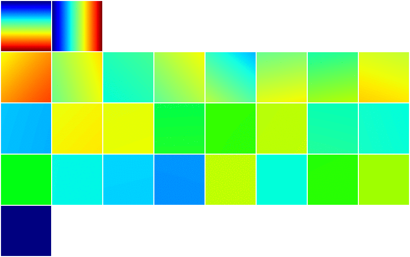
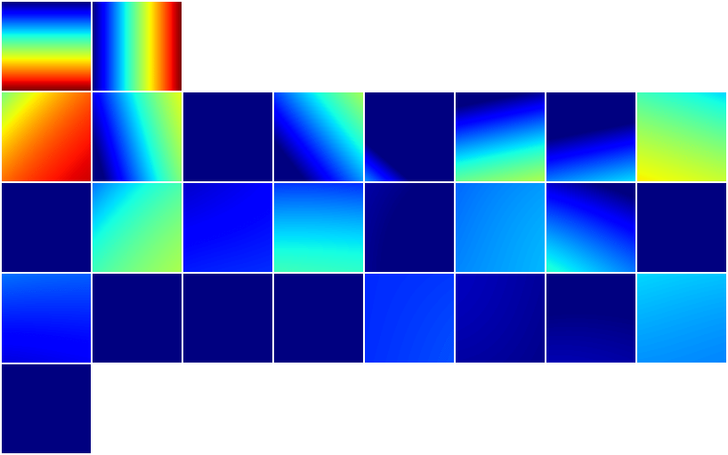
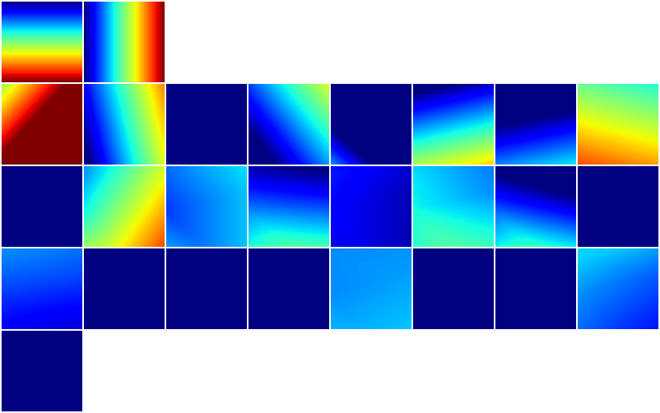
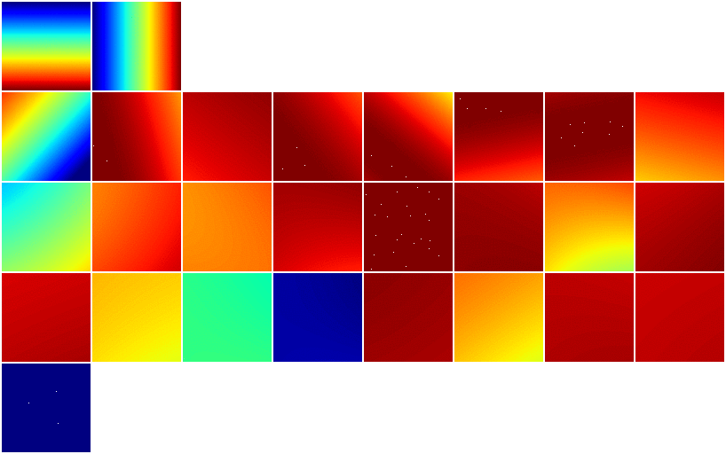
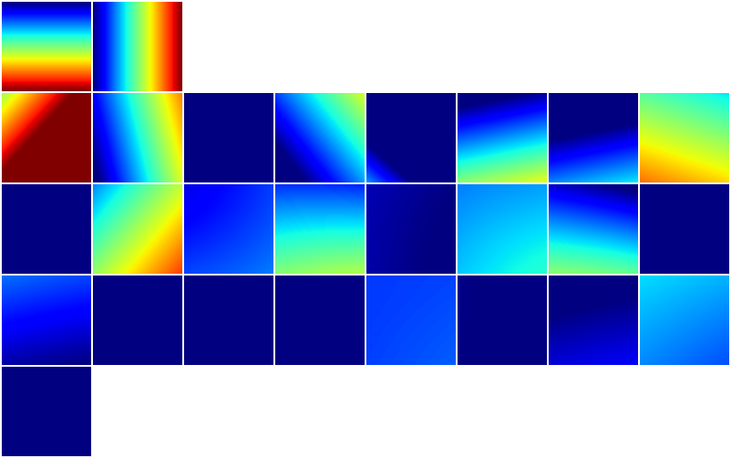
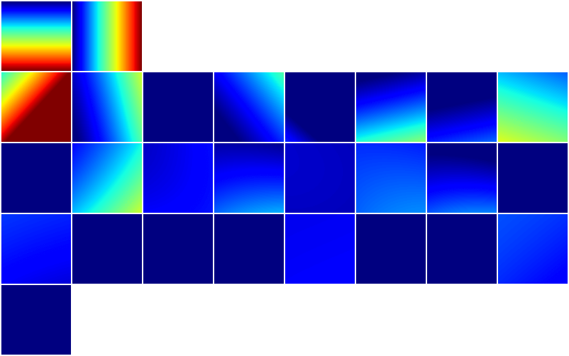
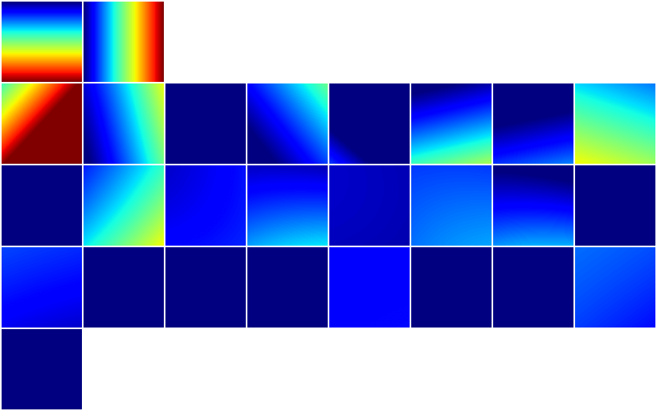
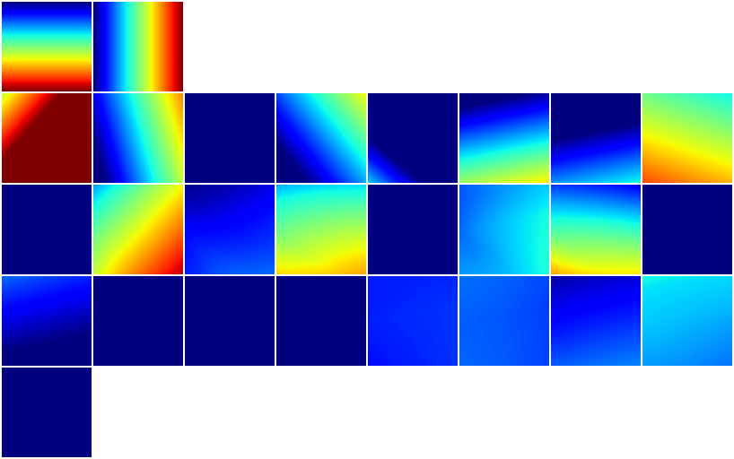
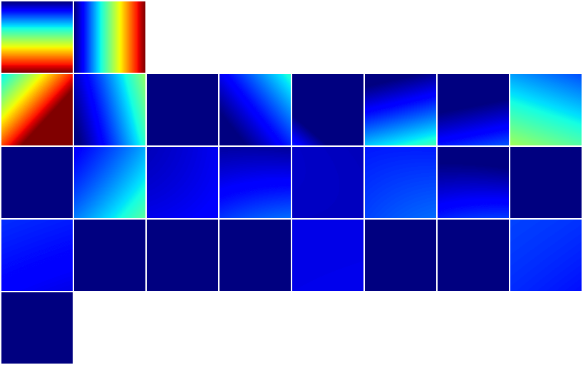

# nn hidden visu

## Sigmoid

---

## tanh
[tanh](https://pytorch.org/docs/stable/generated/torch.nn.functional.tanh.html#torch.nn.functional.tanh)

---
## ReLU
[ReLU](https://pytorch.org/docs/stable/generated/torch.nn.functional.relu.html#torch.nn.functional.relu)

---

## LeakyReLU
[LeakyReLU](https://pytorch.org/docs/stable/generated/torch.nn.functional.leaky_relu.html#torch.nn.functional.leaky_relu)

---

## ELU
[ELU](https://pytorch.org/docs/stable/generated/torch.nn.functional.elu.html#torch.nn.functional.elu)

---

## Cosine

---

## CELU
[CELU](https://pytorch.org/docs/stable/generated/torch.nn.functional.celu.html#torch.nn.functional.celu)

---

## GELU
[GELU](https://pytorch.org/docs/stable/generated/torch.nn.functional.gelu.html#torch.nn.functional.gelu)

---

## Mish
[Mish](https://pytorch.org/docs/stable/generated/torch.nn.functional.mish.html#torch.nn.functional.mish)

---

## SELU
[SELU](https://pytorch.org/docs/stable/generated/torch.nn.functional.selu.html#torch.nn.functional.selu)

---

## SiLU
[SiLU](https://pytorch.org/docs/stable/generated/torch.nn.functional.silu.html#torch.nn.functional.silu)

